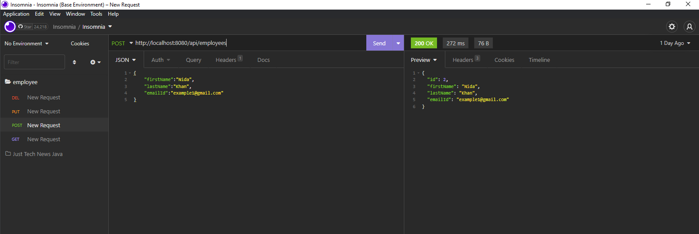

# Employee Tracker

This Spring Boot Java API performs basic CRUD operations to track employee names and emails.

## Table of Contents

* [Installation](#installation)
* [Built Using](#built)
* [Usage Information](#usage)
* [Authors & Acknowledgements](#credits)
* [Contact](#questions)

## Installation 
After cloning the repository, update the password variable in application.properties with your MySQL password. Then run the application and access the database at localhost 8080.

## Built Using 
* Java
* MySQL
* Spring Boot
* Spring Web
* Spring Data JPA

## Usage Information
This application keeps a list of employee information.

  

## Authors & Acknowledgements

This application was written following the tutorial available [here](https://www.twilio.com/blog/create-rest-apis-java-spring-boot). 

Made by [TOVTC](https://github.com/TOVTC).

## Questions?
Contact repository author via [GitHub](https://github.com/TOVTC). 
    
